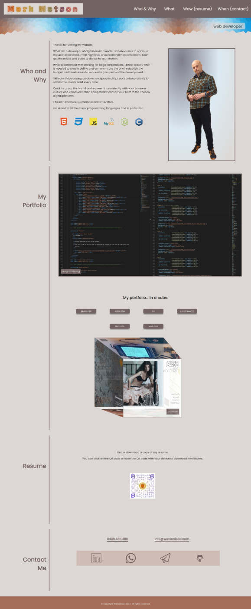
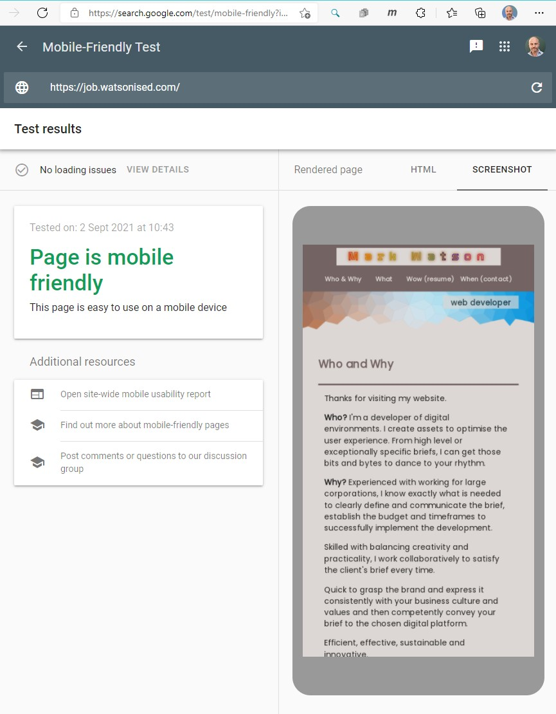

# USYD-FSF Week2 Project
## Advanced CSS: Portfolio

### Table of Contents  
  
   1. [Project Description](#1-description)
   2. [Application Features](#2-features)
   3. [Installation](#3-installation)
   4. [Usage](#4-usage)
   5. [Credits](#5-credits)
   6. [License](#6-license)
   7. [Repository Status](#7-github-repo-status)
   8. [Contribute](#8-how-to-contribute)
   9. [Tests](#9-tests)
   10. [Checklist](#10-checklist)

---
### 1. Description  
**What is this project?**  
* Creating a webpage from scratch, without source code, for use as my portfolio to showcase to potential employers the work I've done.  This project provides potential employers with samples of my work for them to assess if I'm a good candidate for an open position.  

**Why this project?**  
* To find employment it is essential to have a good portfolio of projects that demonstrates my capability as a developer. 

**What problem does this project solve?**  
* Responsive website using the CSS flexbox property.

**Lessons learnt?**  
* This project helped me get my head around how to manage 'flexbox' when setting up my website. The true strength of flexbox is doing a number of sub-flexboxes to achieve your desired layout.
* A wireframe was started for this project however I used the homework brief example to structure my webpage.  In future, time permitting, I will make sure I have completed the wireframe exercise.
* I lost lots of time running into snags in this project.  I need to improve working faster initially and doing refinement once the webpage is roughed in. Currently I've found I get really distracted with my layout and then later I decide to drop another object in and then need to go back and re-layout.
* Discovered compatability issues that were not emulated on my browser's developer device emulator.  Something to watch out for.  Main issue is I discovered buttons are not working on iPhones.  I've swept my CSS with Autoprefixer to fix.

---
### 2. Features  
Client requested features as implemented:  
- Webpage has my name, a recent photo and links to sections about me, my work and how to contact me.
- Selecting any of the links scrolls you to the respective section on my webpage.
- Selecting the link about my work scrolls to my portfolio with titled images of the applications I've developed.
- When presented with my first application, the image is larger in size than the others.
- Selecting any of the images of my applications will take you to the deployed application.
- The layout is responsive and adapts to large screens and mobile phone devices.

#### The webpage

---
### 3. Installation  
You can download the source code from [my Github repository](https://github.com/Mark33Mark/my-portfolio)  and open the index.html file to review the website inside your selected web browser.  
Alternatively, the webpage has also been hosted via [URL: job.watsonised.com](https://job.watsonised.com)

---
### 4. Usage  
The code can be downloaded from [my Github repository](https://github.com/Mark33Mark/my-portfolio) for all assets created for the project.  
You can modify the code as you need.

---
### 5. Credits  
I'm finding my number 1 resource for my CSS is the [W3 Schools website](https://www.w3schools.com).  The guys behind that project are awesome, they leave you with little excuse for not being able to resolve your own problems with their amazing online resource. No other credits for this work as all work has been completed without reference.

---
### 6. License  
 The works in this repository are subject to:  

---
### 7. Github repo status  

---
### 8. How to Contribute
 If you would like to contribute, please comply with the Contributor Covenant Code of Conduct:  

---
### 9. Tests  
- Opened on a Samsung Note 10+ and experienced full functionality and responsive behaviour was as expected.
- Opened on a Apple iPhone X - buttons not working or tooltips.  Swept my CSS with Autoprefixer but behaviour unchanged.  Did a web search and could not find any reasonable solutions, one site suggested moving buttons higher with z-index property but didn't try as it seems illogical and will interfere with the fixed navigation header.
- Ran the Google mobile friendly test and got the ok:

---
### 10. Checklist  
 All actions not checked are still to be completed:
  * [x]  Webpage has my name, a recent photo and links to sections about me, my work and contact details.
  * [x]  Selecting any of the navigation links will scroll the page to the selected section of my website.
  * [x]  Selecting the link about my work scrolls you to my portfolio with title image of the applications I've developed.
  * [x]  The first application is my portfolio has an image larger than the others.
  * [x]  Selecting any of the images of my applications will take you to the deployed application.
  * [x]  Webpage is responsive and adapts to large screens through to mobile device screens.
  * [x]  Deployed at live URL, [website](https://job.watsonised.com) 
  * [x]  Application loads with no errors.
  * [x]  Github repository contains application code [Github location](https://github.com/Mark33Mark/my-portfolio)
  * [x]  Repository has a unique name; follows best practice for file structure; and naming conventions.
  * [x]  The application resembles the mock-up functionality provided in the assigment instructions.
  * [x]  Repsository follows best practices for class/id naming conventions, indentation, quality comments, etc.
  * [x]  Repository contains multiple descriptive commit messages.
  * [x]  Repository contains a README file with descriptio, screenshot and link to deployed application.
---

- [Back to the top](#usyd-fsf-week2-project)